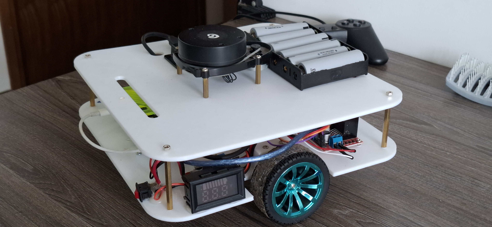
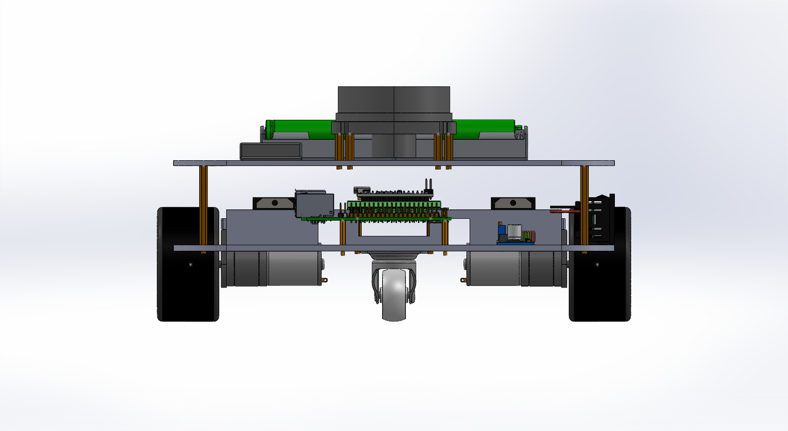
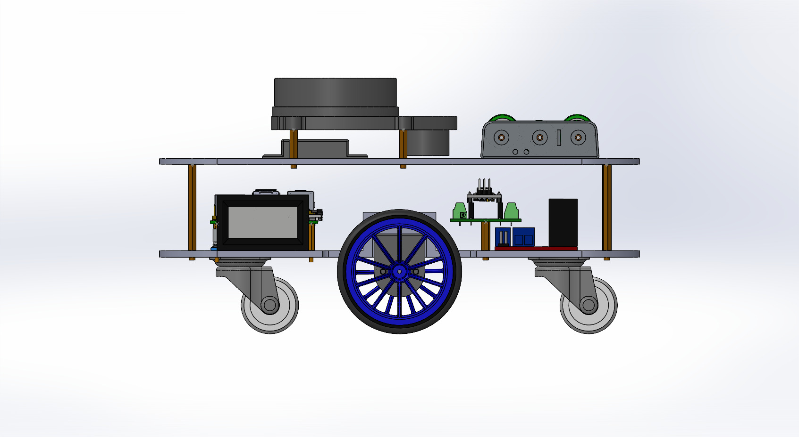
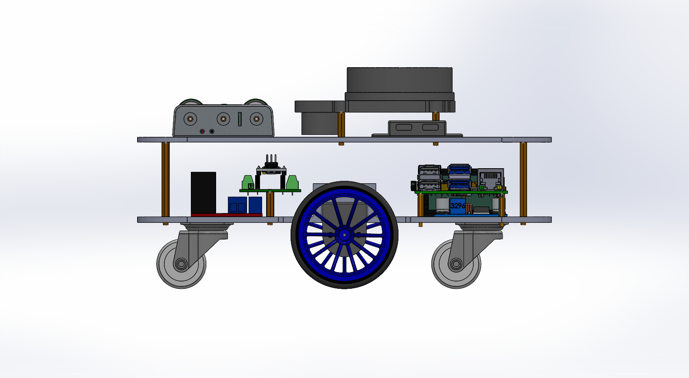
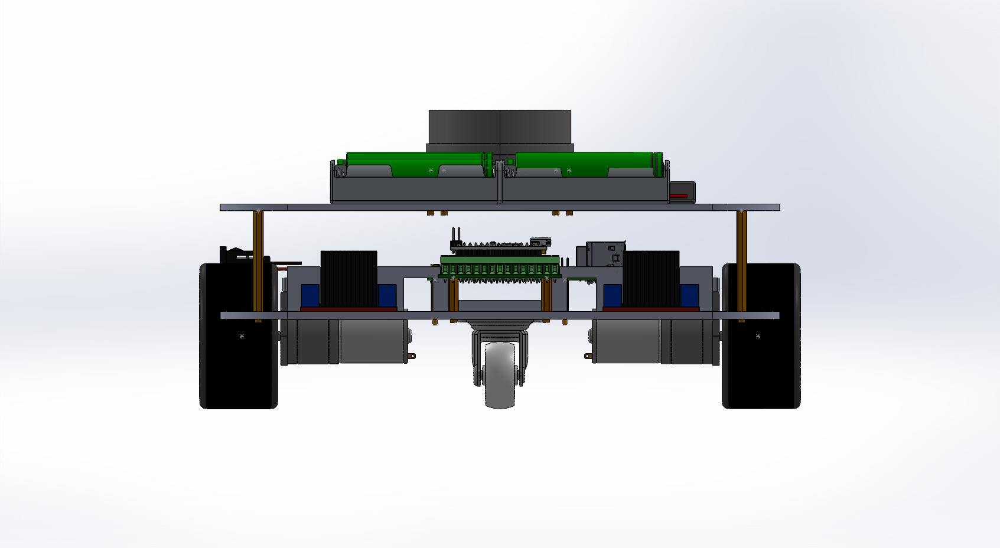
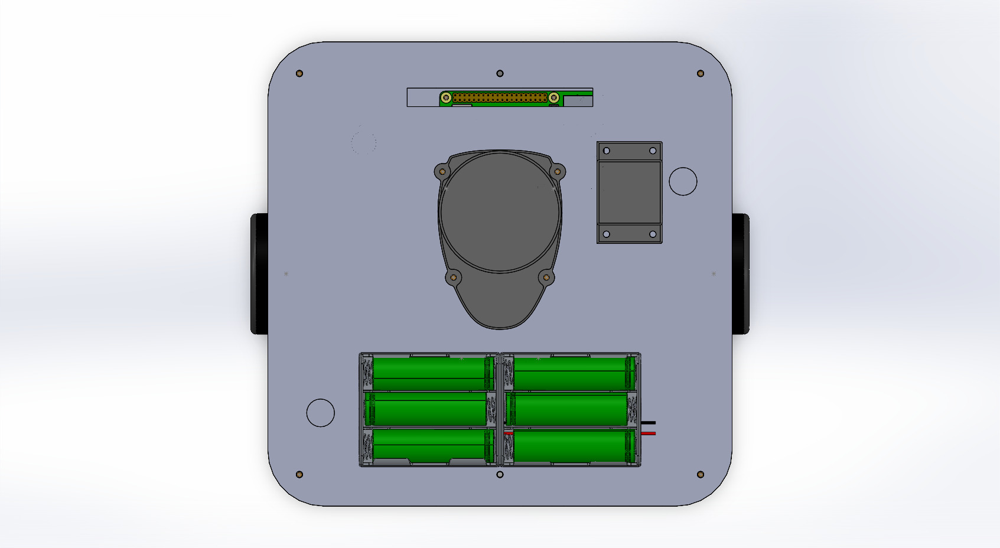
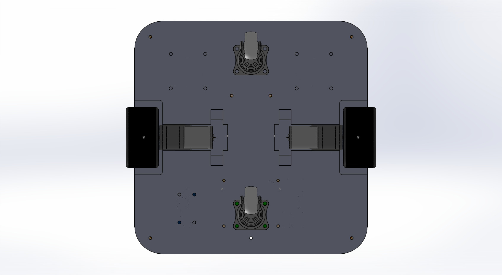
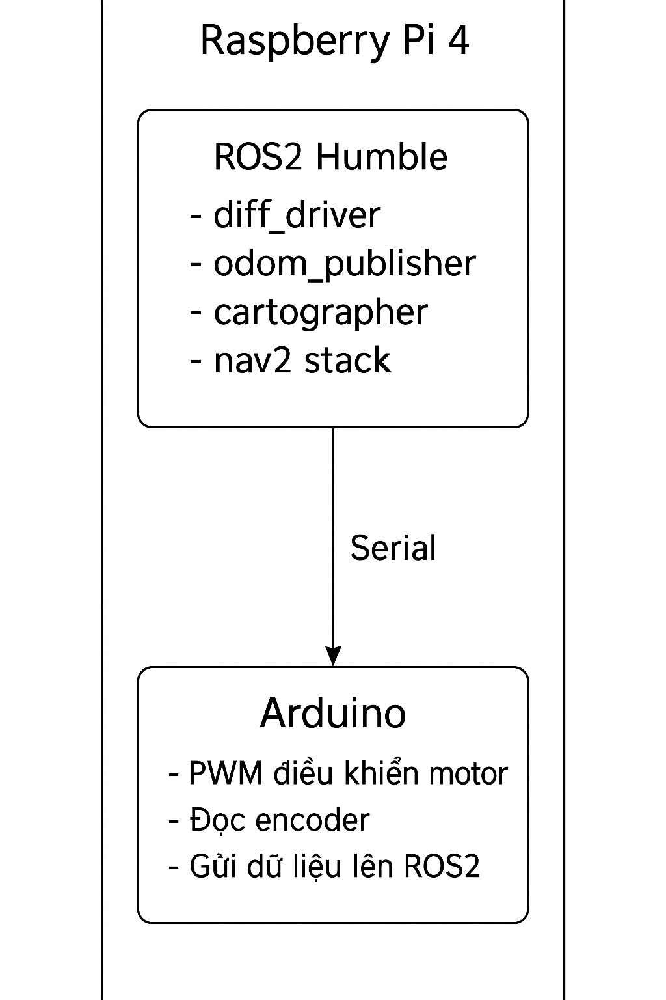

# Diff Robot – ROS2 Mapping & Navigation



Differential Drive Robot system supports mapping, localization and navigation using **Cartographer, Nav2, LiDAR, Raspberry Pi 4** and **Arduino/ESP32** encoder communication to calculate odometry.

### System overview
The robot consists of 3 main parts:
- **Low-level control layer**
Arduino/ESP32 reads encoder, controls motors and sends data via serial.
- **Compute Layer**
Raspberry Pi 4 runs ROS2, receives encoder data from Arduino to calculate odometry, reads LiDAR data to do SLAM, and runs Nav2 to move automatically.
- **Application & Monitoring**
Rviz2 to observe 3D robot, trajectory, map, TF, Nav2 status,…

### Hardware
- Raspberry Pi 4 (4GB or 8GB)

- Arduino Nano / ESP32 for motor control & encoder reading
- Motor driver L298N / BTS7960 / Cytron
- Motor GA25 – 120RPM, 7.3kg.cm (stall), 1.8A with load
- LiDAR (YDLIDAR X3 Pro or RPLIDAR A1/A2)
- Battery power 12V 10C
- Robot frame + wheels

<p align="center">
  
  
  
</p>
<p align="center">
  
  
  
</p>

### Communication between ROS2 ↔ Arduino


- ROS2 uses node diff_driver.py to communicate with Arduino via serial /dev/arduino (57600 baud).
- Sen command **m 100 100"** to set frame rate
- Send command **"o 100 100"** set PWM
- Send command "e" to get encoder data. Arduino will send to Pi in form **"e_left e_right"**
- Send **"r"** command to reset encoder value

diff_driver.launch.py

- Open serial
- Send motor command (PWM + direction)
- Receive encoder
- Publish to topic: /left_speed
/right_speed

### Mapping – Cartographer
Cartographer will subscribe:
- /scan from LiDAR
- /odom (Self published odom)

```
ros2 launch robot_mapping cartographer.launch.py
```
Save map
```
ros2 run nav2_map_server map_saver_cli -f my_map
```


### Navigation 2
- map server
- amcl (localization)
- controller server
- planner server
- smoother server
- BT navigator
- Lifecycle manager

```
ros2 launch robot_navigation naviagation.launch.py
```


## Author
- Name: BUI QUOC DOANH
- Email: doanh762003@gmail.com
- Project: diff robot

## License
This project is released under the [MIT License](https://opensource.org/license/mit)