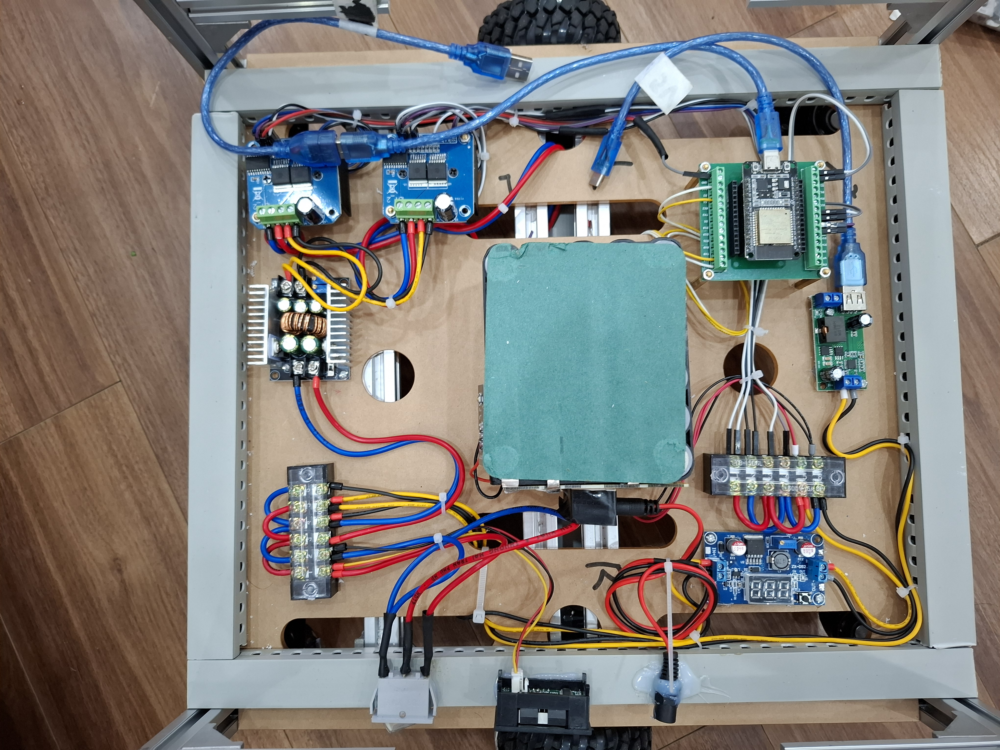
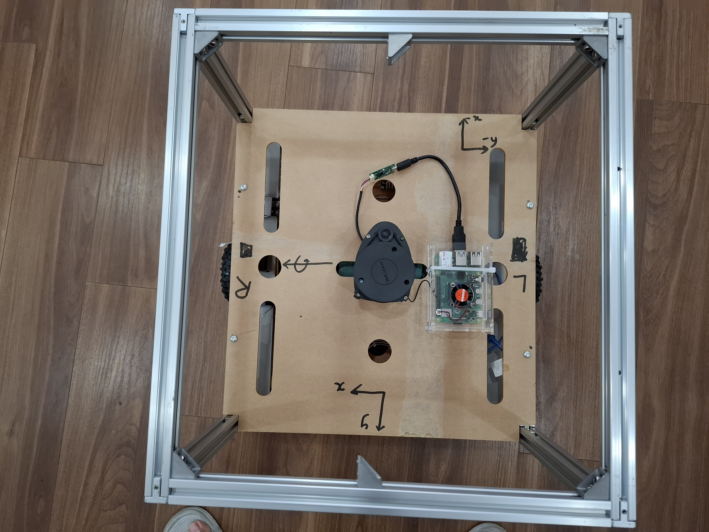
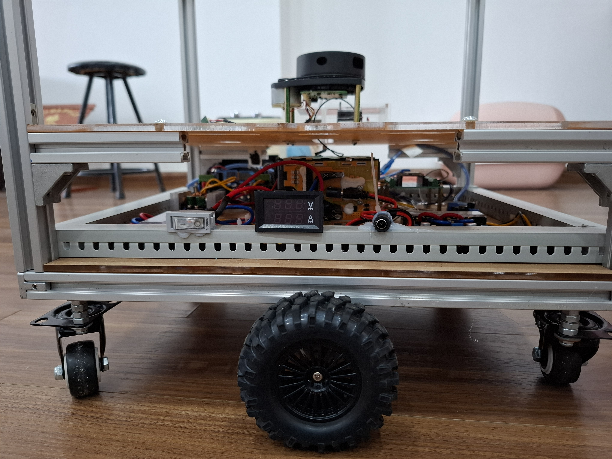
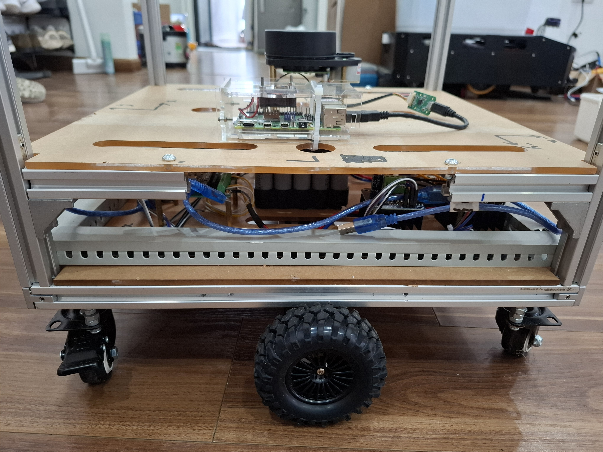
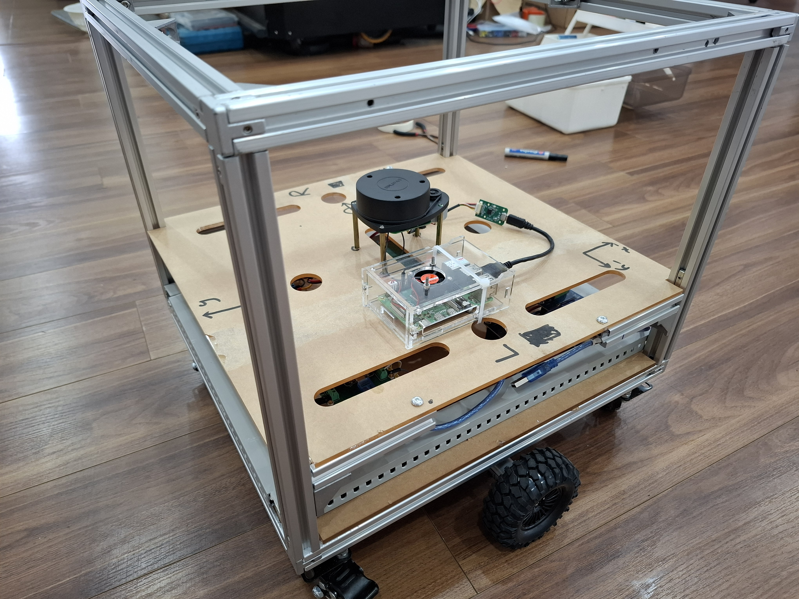
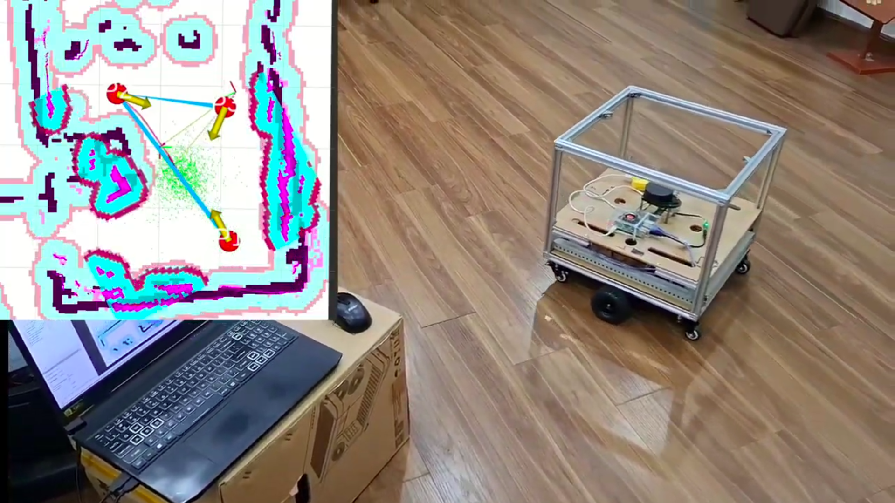

# Diff Robot – ROS2 Mapping & Navigation

Hệ thống robot dẫn động vi sai cho phép mapping, localization và điều hướng tự động sử dụng **Cartographer, Nav2, LiDAR, Raspberry Pi 4** và **Arduino/ESP32** để đọc encoder và tính odometry.

## Summary

Repository `diff_robot_v2` chứa các package ROS2 chính cho việc điều khiển thấp (ESP32/Arduino), xử lý dữ liệu LiDAR, SLAM (Cartographer), và điều hướng (Nav2). Mục tiêu là cung cấp một nền tảng dễ cài đặt để thử nghiệm mapping & navigation trên robot di động vi sai.

## System overview

Hệ thống gồm 3 lớp chính:
- Low-level control layer: ESP32/Arduino đọc encoder, điều khiển động cơ và trả dữ liệu qua serial.
- Compute layer: Raspberry Pi 4 chạy ROS2, nhận dữ liệu encoder để tính odometry, đọc LiDAR để SLAM, chạy Nav2 để điều hướng.
- Application & Monitoring: Rviz2 để quan sát TF, bản đồ, quỹ đạo, trạng thái Nav2 và `route_manager` để quản lý các waypoint/route.

## Hardware

- Raspberry Pi 4 (4GB / 8GB)
- ESP32 hoặc Arduino Nano cho điều khiển động cơ và đọc encoder
- Motor driver: L298N hoặc BTS7960 (tùy công suất)
- Động cơ: Motor Planet 320RPM 24V (encoder 13 pulses) — thông tin encoder cần được cấu hình đúng trong firmware
- LiDAR: RPLidar A1M8 (hoặc tương đương)
- Pin: Li-ion 24V (hoặc nguồn phù hợp với driver/động cơ)

Hình ảnh phần cứng:

<p align="center">
  
  
</p>
<p align="center">
  
  
  
</p>

## Control (ESP32 / Arduino)

ESP32/Arduino chịu trách nhiệm đọc encoder, điều khiển công suất (PWM), và trả về thông tin odometry cơ bản (encoder ticks, tốc độ motor). Có hai kiểu triển khai phổ biến trong repo này:

- Firmware trên ESP32/Arduino: đọc encoder, chạy PID (nếu cần), gửi dữ liệu qua serial theo định dạng đơn giản.
- Trên Raspberry Pi: một node ROS2 (serial bridge) đọc dữ liệu serial, chuyển thành các topic ROS2 (ví dụ `/odom`, `/joint_states`) và nhận lệnh vận tốc (`/cmd_vel`) để gửi tới ESP32.

Những giả định thông thường (nếu bạn dùng firmware khác, điều chỉnh tương ứng):
- Baud rate serial: 115200
- Cổng serial trên Pi thường là `/dev/ttyUSB0` hoặc `/dev/ttyACM0` (kiểm tra bằng `ls /dev/ttyUSB*`)

Thực tế cụ thể của node bridge (tên và tham số) có thể khác giữa các package; xem package `robot_bringup` hoặc `robot_control` để biết tên node và tham số chính xác.

## Communication between ROS2 ↔ ESP32
### ESP32
[Github diff_control_esp32](https://github.com/is-buiquocdoanh/diff_control_esp32)

- Firmware ưu tiên nhận gói nhị phân theo cơ chế "CAN-Serial" (`DataPacket`) từ cả USB Serial và UART2 (Serial2). Khi nhận gói nhị phân hợp lệ, ESP32 sẽ giải mã và áp dụng lệnh động cơ.
- Nếu không có gói nhị phân, firmware chấp nhận lệnh ASCII đơn giản qua USB serial (dạng dòng kết thúc bằng `\n`), thuận tiện cho debug/manual control.

Chi tiết packet (như firmware kỳ vọng):
- Packet được đọc bởi `CanSerial::readPacket(DataPacket &pkt)` — structure `DataPacket` chứa `id` và `data[]` (byte array). Firmware sử dụng các byte dữ liệu như sau:
  - `data[0]` = left wheel direction (lf_dir)
  - `data[1]` = left wheel PWM (lf_pwm)
  - `data[2]` = right wheel direction (rf_dir)
  - `data[3]` = right wheel PWM (rf_pwm)
  - (other bytes may be present but are ignored by firmware)

Ví dụ (giả định tạo DataPacket tương đương):
- lf_dir=1, lf_pwm=200, rf_dir=2, rf_pwm=200 -> ESP32 sẽ set left pwm=200 dir=1 và right pwm=200 dir=2.

Fallback ASCII command set (USB serial, newline-terminated):
- `M <L_pwm> <L_dir> <R_pwm> <R_dir>` — set both motors
- `L <pwm> <dir>` — set left motor only
- `R <pwm> <dir>` — set right motor only
- `S` — stop both motors

Thông số cổng/baud và an toàn:
- Baud mặc định: 115200 (USB và Serial2)
- Serial2 pins mặc định: RXD2=16, TXD2=17 (có thể thay đổi trong firmware nếu cần)
- Safety timeout: nếu không nhận được gói nhị phân trong `PACKET_TIMEOUT_MS` (mặc định 1000 ms), firmware sẽ dừng động cơ để đảm bảo an toàn.

Kiểm tra cổng serial và quyền truy cập:

```bash
# liệt kê cổng serial
ls /dev/ttyUSB* /dev/ttyACM* || true

# nếu thiếu quyền, thêm user vào nhóm dialout
sudo usermod -a -G dialout $USER
```

Gợi ý tích hợp ROS2 (`kinematic_serial.py` trong `robot_control`):
- Tốt nhất là gửi gói theo định dạng CAN-Serial nhị phân tương thích với `CanSerial` trên ESP32 (nếu `kinematic_serial.py` đã có helper để đóng gói DataPacket). Nếu không, gửi ASCII theo mẫu `M ...` rất tiện cho debug.
- Nếu bạn muốn, tôi có thể chỉnh `kinematic_serial.py` để nó gửi gói nhị phân tương thích hoặc gửi ASCII — gửi file `kinematic_serial.py` (hoặc chấp nhận tôi đọc nó trong workspace) và tôi sẽ cập nhật.

Ghi chú: kiểm tra implementation của `CanSerial` (ESP32) và phần gửi ở phía ROS2 để đảm bảo `id`, `data` layout và bất kỳ CRC/framings nào khớp nhau.

---
### Kinematic_serial.py
Thông tin chi tiết lấy trực tiếp từ `src/robot_control/robot_control/kinematic_serial.py` (một số tham số mặc định):

- Node: `kinematic_serial` (ROS2) subscribes to `/cmd_vel` và gửi frame CAN-serial xuống ESP32.
- Tham số mặc định quan trọng:
  - `serial_port`: `/dev/ttyUSB0`
  - `baudrate`: `115200`
  - `rate`: `20` (Hz) — tần suất gửi frame xuống ESP32
  - `log_rate`: `2` (info logs per second)
  - `wheel_radius`: `0.048` (m)
  - `wheel_base`: `0.35` (m)
  - `rpm_max`: `255` (giá trị rpm tối đa dùng để ánh xạ tới PWM 0..255)
  - `frame_id`: `1` (sẽ được đóng gói little-endian vào 4 byte id)
  - `deadband_linear`: `0.02` (m/s)
  - `deadband_angular`: `0.05` (rad/s)
  - `stop_timeout`: `1.0` (s) — nếu không nhận `/cmd_vel` trong khoảng này, node sẽ gửi lệnh dừng (zeros)
  - `min_pwm_threshold`: `6` — PWM <= threshold sẽ được coi là 0 để tránh drift

Chuyển đổi kinematics -> PWM:

- Node thực hiện differential kinematics:
  - v_l = v - omega * (wheel_base/2)
  - v_r = v + omega * (wheel_base/2)
  - rpm = (v_wheel / wheel_radius) * 60 / (2*pi)
- Sau khi có rpm (clip trong [-rpm_max, rpm_max]) node ánh xạ giá trị tuyệt đối rpm sang PWM bằng công thức:
  - pwm = round(abs(rpm) * 255 / max(1.0, rpm_max))
- Nếu pwm <= `min_pwm_threshold` thì pwm được đặt về 0 để tránh drift
- Direction được gán như sau:
  - dir = 1 if rpm > 0 and pwm > 0
  - dir = 2 if rpm < 0 and pwm > 0
  - dir = 0 if pwm == 0

Frame/Cấu trúc packet thực tế gửi (được `kinematic_serial.build_packet` tạo):

- Header: 0x2A (1 byte)
- ID: 4 bytes little-endian (unsigned int) — mặc định `frame_id` = 1 -> `0x01 0x00 0x00 0x00`
- Data: 8 bytes
  - data[0] = LF_dir
  - data[1] = LF_pwm
  - data[2] = RF_dir
  - data[3] = RF_pwm
  - data[4..7] = 0 (unused)
- Tail: 0x23 (1 byte)

Tổng độ dài gói: 1 + 4 + 8 + 1 = 14 bytes

Ví dụ gói hex (Left forward 200, Right backward 200, frame_id=1):

```
2A 01 00 00 00 C8 00 02 C8 00 00 00 00 23
```

Hành vi an toàn / timing:

- Node `kinematic_serial` gửi gói ở tần suất `rate` (mặc định 20 Hz). Nếu không có `/cmd_vel` mới trong `stop_timeout` (mặc định 1.0 s), node sẽ gửi zeros (lf_dir=0, lf_pwm=0, rf_dir=0, rf_pwm=0).
- Firmware ESP32 có `PACKET_TIMEOUT_MS` (mặc định 1000 ms) — nếu ESP32 không nhận gói nhị phân trong khoảng này, firmware cũng sẽ dừng động cơ.

Khuyến cáo tích hợp:

- Đồng bộ `serial_port`, `baudrate` và `frame_id` giữa ROS2 node và firmware ESP32 trước khi thử nghiệm.
- Nếu muốn debug nhanh, dùng ASCII fallback (`M`/`L`/`R`/`S`) qua USB serial; cho vận hành thực tế nên dùng packet nhị phân CAN-Serial để tận dụng timeout/safety mặc định.


## Mapping – Cartographer

Cartographer được cấu hình trong package `robot_mapping`.

Launch basic SLAM:

```bash
ros2 launch robot_mapping cartographer.launch.py
```

Lưu bản đồ khi đã chạy xong:

```bash
ros2 run nav2_map_server map_saver_cli -f my_map
```

Lưu ý cấu hình:
- Frame conventions: `base_link`, `odom`, `map` — đảm bảo các TF này được publish chính xác.
- Nếu bản đồ nhiều nhiễu: kiểm tra chất lượng dữ liệu LiDAR, tần số, và tham số trong cấu hình Cartographer (voxel_filter, scan matcher, odom frame).

## Navigation 2 (Nav2)

Repository bao gồm cấu hình và các launch file cho Nav2. Các thành phần chính:

- map server
- AMCL (hoặc dùng localization SLAM Toolbox)
- controller server (ví dụ DWB)
- planner server (ví dụ navfn hoặc grid_based)
- BT navigator
- lifecycle manager

Khởi động Nav2 (ví dụ):

```bash
ros2 launch robot_navigation naviagation.launch.py
```

Điểm cần kiểm tra khi sử dụng Nav2:
- Costmap parameters (inflation, robot radius)
- Controller & planner selection
- TF latency và độ chính xác của odometry (odom phải ổn định)
- Global planner vs local planner tuning để tránh trạng thái oscillation

## Route manager

`route_manager` trong workspace dùng để lưu trữ và quản lý các waypoint/route. Tính năng thường bao gồm:

- Tải danh sách waypoint từ file YAML
- Lưu/khôi phục route
- Gửi tuần tự các mục tiêu tới Nav2 để tự động di chuyển

Ví dụ (khởi chạy route manager):

```bash
ros2 run route_manager route_tool
```
- route_tool này sẽ giúp chọn các điểm trên bản đồ

```bash
ros2 launch route_manager route_manager.launch.py
```
- Sau khi đã có danh sách điểm route.yaml và khởi động nav2
- Chạy file launch trên để robot thực hiện nhiệm vụ theo route



### [Video demo](https://youtu.be/bw5MeLfEKC0)

## Quick start (cài đặt nhanh)

Yêu cầu trước khi bắt đầu:
- ROS2 (Humble hoặc mới hơn khuyến nghị)
- Python3, pip, colcon
- Quyền truy cập serial (nhóm `dialout`)

Build workspace và source môi trường:

```bash
# từ thư mục gốc repo
colcon build --symlink-install
source install/setup.bash
```

Chạy SLAM (ví dụ):

```bash
ros2 launch robot_mapping cartographer.launch.py
```

Chạy Nav2 (sau khi có map/odom ổn định):

```bash
ros2 launch robot_navigation naviagation.launch.py
```

Gửi lệnh tay qua topic `/cmd_vel` để kiểm tra điều khiển thấp:

```bash
ros2 topic pub /cmd_vel geometry_msgs/msg/Twist "{linear: {x: 0.2}, angular: {z: 0.0}}"
```

## Contributing

- Fork repo, tạo branch tính năng (`feature/xxx`) và gửi pull request.
- Viết mô tả thay đổi rõ ràng, kèm cách tái tạo và kiểm tra.
- Nếu thêm firmware mới cho ESP32/Arduino, đặt trong `src` hoặc link đến thư mục `firmware` và bổ sung hướng dẫn cài vào README.

## Changelog

- diff_robot_v2: cập nhật cấu trúc repo, cải thiện launch và cấu hình cho ROS2 mapping & navigation.

## Author
- Name: BUI QUOC DOANH
- Email: doanh762003@gmail.com
- Project: diff robot

## License
This project is released under the [MIT License](https://opensource.org/license/mit)