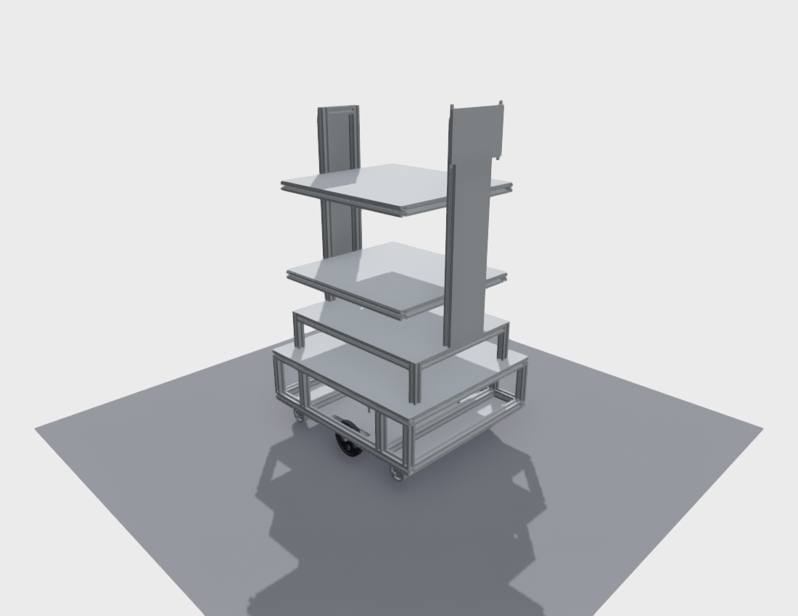
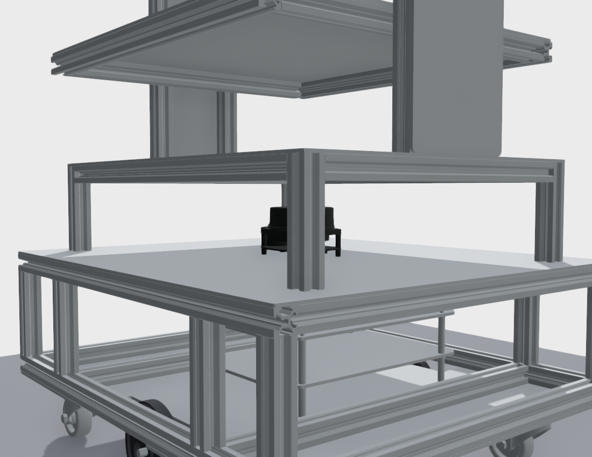

# a3_description

Mô tả URDF/xacro cho robot **A3** — xe đẩy nhiều tầng, dẫn động vi sai
(differential drive) + 4 bánh caster ở 4 góc + RPLidar.



## Trả lời câu hỏi "có nên copy caster_wheel.STL thành 4 file không?"

**Không.** Một file mesh có thể được dùng lại bao nhiêu lần tùy ý. Trong
`urdf/caster_wheel.xacro` có một macro `caster_wheel`, được gọi 4 lần với
`prefix` khác nhau:

```xml
<xacro:caster_wheel prefix="front_left"  x="${ caster_x}" y="${ caster_y}"/>
<xacro:caster_wheel prefix="front_right" x="${ caster_x}" y="${-caster_y}"/>
<xacro:caster_wheel prefix="rear_left"   x="${-caster_x}" y="${ caster_y}"/>
<xacro:caster_wheel prefix="rear_right"  x="${-caster_x}" y="${-caster_y}"/>
```

Cả 4 link đều trỏ về đúng một file `meshes/caster_wheel.STL`. Copy thành 4 file
chỉ làm nặng repo và mỗi lần sửa CAD phải cập nhật 4 chỗ.

Tương tự với bánh chủ động: `left_wheel.STL` và `right_wheel.STL` của bạn
**trùng nhau từng byte** (cùng md5 `c3ecbcde…`), nên package chỉ giữ một file
`meshes/drive_wheel.STL`, dùng tham số `reflect` (±1) để lật mặt bánh ra ngoài.

## Cây link

```
base_footprint                     (mặt đất, z = 0)
└── base_link                      (tâm trục 2 bánh chủ động, z = 0.0475)
    ├── left_wheel_link            continuous, axis = 0 1 0
    ├── right_wheel_link           continuous, axis = 0 1 0
    ├── front_left_caster_link     fixed
    ├── front_right_caster_link    fixed
    ├── rear_left_caster_link      fixed
    ├── rear_right_caster_link     fixed
    └── laser_link                 fixed
```

`base_link` đặt tại **tâm trục 2 bánh chủ động** để công thức động học vi sai
và odometry dùng trực tiếp không cần bù offset.

## Thông số đo trực tiếp từ STL

| Thông số | Giá trị |
|---|---|
| Bao khung (dài × rộng × cao) | 0.500 × 0.440 × 0.838 m |
| Khoảng sáng gầm | 0.0200 m |
| Bánh chủ động | Ø 0.0950 m, dày 0.0192 m |
| Khoảng cách 2 bánh (`wheel_separation`) | 0.3492 m |
| Bánh caster | Ø 0.0472 m, trail 0.025 m, đế→đất 0.0690 m |
| Lidar (trong `base_link`) | x 0, y 0, z 0.2209 m (giữa sàn tầng 2) |
| Tổng cao đỉnh khung | 0.858 m |

Trục bánh chủ động lấy từ tâm lỗ Ø 8 trên 2 mặt bích trong `chassis.STL`
(mesh x = 57.33 / 387.33, y = 233.03, z = 367.03).

Khối lượng/tensor quán tính của mọi link được tính bằng tích phân thể tích trên
chính mesh (giả sử mật độ đều) rồi quy về khối lượng đặt trong `common.xacro`.
**Hãy sửa 4 giá trị khối lượng** (`chassis_mass`, `wheel_mass`, `caster_mass`,
`lidar_mass`) theo cân thực tế — tensor sẽ tự scale theo.

### Hệ toạ độ của file CAD

STL xuất theo **mm**, hệ **Y-up**, trục Z là chiều dọc thân xe. Trong URDF mọi
mesh của khung/lidar dùng `rpy = (π/2, 0, +π/2)` và `scale = 0.001` để đổi sang
chuẩn ROS REP-103, tức là:

```
ros_x (tiến)  =  mesh_z        ros_y (trái) = mesh_x        ros_z (lên) = mesh_y
```

Phía trước của xe là **đầu mesh z = 617** (ros_x = +0.250) — chính là đầu có
**tấm bắt màn hình VESA** (165 × 127 mm, ở mesh z ≈ 590, cao y ≈ 900–1060).
Muốn đảo đầu xe thì đổi `cad_rpy` trong `common.xacro` thành `−π/2` và đổi dấu
x, y của các origin đã ghi chú kèm.

`left_wheel_link` ở +Y = **bên trái xe**, `right_wheel_link` ở −Y = bên phải —
đúng chuẩn REP-103, không cần đổi tên.

## Chạy thử

```bash
# đặt package vào <ws>/src rồi
colcon build --packages-select a3_description
source install/setup.bash
ros2 launch a3_description display.launch.py
```

Cửa sổ `joint_state_publisher_gui` cho phép kéo slider quay 2 bánh chủ động.

Sinh URDF phẳng để kiểm tra:

```bash
ros2 run xacro xacro urdf/a3.urdf.xacro > /tmp/a3.urdf
check_urdf /tmp/a3.urdf
```

## Chạy trong Gazebo Classic 11

```bash
ros2 launch a3_description gazebo.launch.py
```

Tham số:

| tham số | mặc định | ý nghĩa |
|---|---|---|
| `gui` | `true` | `false` = chạy headless (chỉ gzserver) |
| `rviz` | `false` | mở kèm RViz2 với sẵn display LaserScan + Odometry |
| `world` | `worlds/empty.world` | đường dẫn file `.world` |
| `x` `y` `z` | `0 0 0.02` | vị trí thả robot |

Lái xe:

```bash
ros2 run teleop_twist_keyboard teleop_twist_keyboard
```

Xem đồng thời cả Gazebo lẫn RViz:

```bash
ros2 launch a3_description gazebo.launch.py rviz:=true
```

### Topic

| topic | kiểu | nguồn |
|---|---|---|
| `/cmd_vel` | `geometry_msgs/Twist` | vào — `libgazebo_ros_diff_drive` |
| `/odom` | `nav_msgs/Odometry` | ra — kèm TF `odom → base_footprint` |
| `/scan` | `sensor_msgs/LaserScan` | ra — `libgazebo_ros_ray_sensor`, 720 tia, 10 Hz, 0.15–12 m |
| `/joint_states` | `sensor_msgs/JointState` | ra — 2 khớp bánh chủ động, 50 Hz |

Trong mô phỏng **không chạy** `joint_state_publisher`: Gazebo tự publish
`/joint_states` cho 2 bánh, `robot_state_publisher` lo phần TF còn lại.

### Vì sao caster là khớp cố định

4 caster để **khớp cố định + quả cầu va chạm `mu = 0`** thay vì mô hình 2 khớp
xoay thật. Solver vật lý ổn định hơn hẳn (không có khớp xoay tự do dao động) mà
hành vi vẫn đúng: quả cầu không ma sát trượt tự do mọi hướng, đúng như caster.
Đổi lại, caster **không quay theo** trong hình ảnh — chỉ là vấn đề thị giác.

Chỉ sinh file URDF phẳng cho Gazebo:

```bash
ros2 run xacro xacro urdf/a3.urdf.xacro sim_gazebo:=true > /tmp/a3_gz.urdf
```

## Vị trí lidar



Lidar đặt **chính giữa sàn tầng 2**, đáy vỏ tì lên mặt sàn:

| | mesh y (mm) | so với `base_link` (m) | so với mặt đất (m) |
|---|---|---|---|
| Mặt trên sàn tầng 2 | 410.63 | 0.17760 | 0.22510 |
| Trục quay lidar (`laser_link`) | 453.94 | 0.22091 | 0.26841 |
| Đỉnh lidar | 464.13 | 0.23110 | 0.27860 |
| Kết cấu kế tiếp phía trên | 490.63 | 0.25760 | 0.30510 |

`laser_link` nằm đúng trên trục dọc xe (x = 0, y = 0) nên `/scan` đối xứng,
không cần bù offset khi làm SLAM/navigation.

Lidar được xoay **+90° quanh trục đứng** (`lidar_yaw` trong `common.xacro`):

| trục `laser_link` | chỉ về |
|---|---|
| đỏ X | sang trái xe (+Y) |
| xanh lá Y | phía sau xe (−X) |
| xanh dương Z | lên trên (+Z) |

Cả vỏ lidar lẫn hệ trục cùng xoay, đúng như xoay thiết bị thật trên giá đỡ.
Đổi `lidar_yaw` sang `-1.5707963268` là xoay ngược đúng 180°: trục đỏ X sang
phải, trục xanh lá Y về phía trước.

Khoang này cao 80 mm, lidar cao 53.5 mm → dư 26.5 mm. Cản trở duy nhất trong
tầm quét là **4 cột nhôm 20×20 mm** ở `(±0.210, ±0.160)` m. Đo trên Gazebo:
4 cụm bị chặn tại **±37.3°** và **±142.7°**, khoảng cách 0.257 m, mỗi cụm rộng
**~6.2°** — tổng **50/720 tia (6.9%)**. Đây là giới hạn của kết cấu khung, không
phải lỗi mô hình.

Các cao độ mặt sàn đo được (mesh y, mm) nếu bạn muốn đổi tầng khác — chỉ cần
sửa `deck2_top_z` trong `common.xacro`:

| tầng | mặt trên (mesh y, mm) | so với mặt đất | `deck2_top_z` tương ứng |
|---|---|---|---|
| 1 (sàn đáy) | 267.80 | 0.0823 m | 0.03477 |
| **2** | **410.63** | **0.2251 m** | **0.17760** |
| 3 | 513.63 | 0.3281 m | 0.28060 |
| 4 | 636.63 | 0.4511 m | 0.40360 |
| 5 | 856.13 | 0.6706 m | 0.62310 |

## Mesh

`meshes/` chứa bản đã giảm tam giác **theo từng khối rời**, sai lệch bề mặt
dưới 0.6 mm và **bounding box giữ nguyên** nên mọi origin trong URDF vẫn đúng.

| file | gốc | trong package | lệch |
|---|---|---|---|
| chassis.STL | 463 144 tris / 23.2 MB | 126 440 tris / 6.3 MB | 0.35 mm |
| RP-Lidar.STL | 384 150 tris / 19.2 MB | 25 078 tris / 1.3 MB | 0.53 mm |
| caster_wheel.STL | 39 076 tris | 7 070 tris / 0.4 MB | 0.31 mm |
| left_wheel.STL | 2 952 tris | `drive_wheel.STL`, giữ nguyên | 0.01 mm |

Tổng cảnh phải render: **185 702** tam giác (trước khi tối ưu là 1 009 502 —
gzclient treo, cửa sổ báo *not responding*).

### Vì sao phải decimate theo từng khối rời

Chạy `simplify_quadric_decimation` trên **nguyên** mesh làm **hỏng** khung:
thuật toán chỉ có một ngân sách tam giác chung nên nó xoá sạch các chi tiết nhỏ
mà tinh — 4 thanh nhôm định hình 20×20 có rãnh T giữa tầng 1 và tầng 2 — trong
khi vẫn giữ nguyên mấy khối thừa tam giác: 2 **motor**, mỗi cái 123 272 tam
giác cho một vật chỉ 95×38×38 mm (562 tam giác/cm², và bị khung che kín).
Hậu quả: mất hẳn một đoạn dài ~44 mm trên 4 thanh đó, sai lệch **25 mm**, và
sai y hệt ở **mọi** mức target từ 60k đến 300k (trên 463k).

Cách đúng: tách mesh thành các khối rời (`chassis.STL` có **82 khối**) rồi cấp
ngân sách cho từng khối theo **diện tích bề mặt của chính nó**
(25 tam giác/cm², sàn tối thiểu 200). Khối vốn đã thưa thì giữ nguyên, khối
thừa tam giác thì cắt mạnh. Sai lệch từ 25 mm xuống **0.35 mm**.

Tạo lại mesh:

```bash
python3 scripts/decimate_meshes.py /đường/dẫn/tới/thư_mục_STL_gốc
```

Kiểm tra mesh còn khớp file gốc không (ngưỡng 1 mm):

```bash
python3 scripts/check_meshes.py /đường/dẫn/tới/thư_mục_STL_gốc
```

Va chạm **không** dùng mesh: bánh là hình trụ, caster là quả cầu, lidar là hộp
— nhanh và ổn định hơn nhiều cho mô phỏng.

Khung **không** dùng một khối hộp bao duy nhất. Lý do: lidar nằm bên trong
khung, nên một hộp bao sẽ bọc kín nó và **mọi tia quét đập vào thành hộp** —
lidar mù hoàn toàn (đã kiểm chứng: 720/720 tia trả về 0.199–0.357 m). Vì vậy
collision của `base_link` được tách 3 phần, chừa đúng khe lidar:

| phần | z (base_link) | kích thước |
|---|---|---|
| thân dưới | −0.0275 … 0.1776 | 0.500 × 0.440 × 0.2051 |
| 4 cột 20×20 | 0.1776 … 0.2576 | 0.020 × 0.020 × 0.080 |
| thân trên | 0.2576 … 0.8104 | 0.454 × 0.3705 × 0.5528 |

Mặt phẳng quét ở z = 0.2209 nằm gọn trong khe nên tia đi thẳng ra ngoài, chỉ bị
4 cột che.

## Những chỗ nên kiểm tra lại với bản vẽ

1. **Cao độ đế caster.** Đang đặt sao cho 4 caster chạm đất đúng z = 0 cùng lúc
   với 2 bánh chủ động, tức mặt đế caster ở 0.0690 m so với đất. Mặt dưới sàn
   đáy khung trong CAD ở 0.0793 m — chênh **10.3 mm**. Nghĩa là hoặc caster bắt
   qua tấm kê 10 mm, hoặc bánh chủ động có nhún lò xo. Nếu thực tế khác, chỉ
   cần sửa `caster_plate_to_ground` trong `common.xacro`.
2. **Vị trí X/Y của 4 caster** (`caster_x = 0.190`, `caster_y = 0.165`) đang đặt
   theo 4 góc sàn đáy sao cho vùng quét của caster không vượt ra ngoài khung.
   Sửa lại theo đúng lỗ bắt bulông nếu cần.
3. **Cao độ mặt phẳng quét lidar.** `laser_link` đặt tại trục quay đầu lidar,
   cao 43.3 mm so với đáy vỏ lidar (ước lượng từ khe quét trên mesh). Nếu có số
   liệu chính xác từ datasheet, sửa `lidar_axis_up` trong `common.xacro`.
