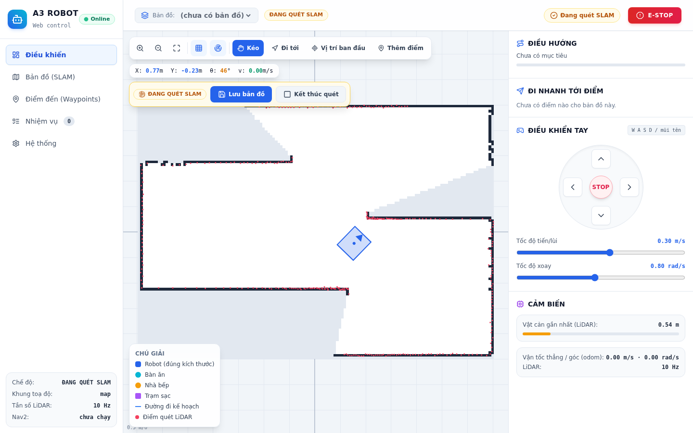
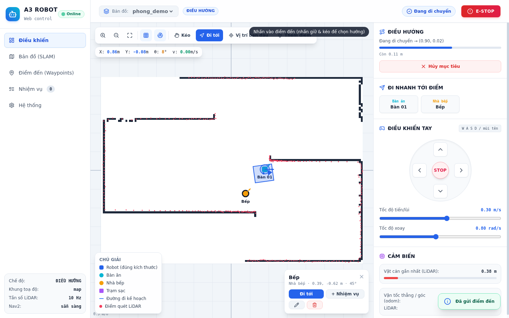

# a3_web — điều khiển robot A3 hoàn toàn bằng web

Mở trình duyệt là dùng được robot: **quét bản đồ, lưu bản đồ, chọn bản đồ, tạo điểm đến, bấm để robot tự
đi (Nav2), lái tay, hàng đợi giao đồ** — không cần tự gõ các lệnh `ros2 launch` cho bringup / SLAM / Nav2.
Web tự bật/tắt các stack đó giúp bạn (chính là các launch có sẵn trong `a3_bringup` và `atlas_slam`).

| Quét SLAM (bản đồ hiện dần) | Điều hướng (waypoint, đường đi, tiến độ) |
|---|---|
|  |  |

Chạy offline hoàn toàn (Tailwind + Lucide đã đóng gói sẵn trong `static/vendor/`), dùng được trên laptop
lẫn điện thoại (giao diện responsive).

## Chạy nhanh

```bash
# 1 lần: cài dependency + build
rosdep install --from-paths src --ignore-src -r -y     # cần python3-aiohttp
colcon build --packages-select a3_web && source install/setup.bash

# Chạy web (1 lệnh duy nhất)
ros2 launch a3_web web.launch.py
```

Mở `http://<ip-robot>:8080` (địa chỉ được in ra ở terminal). Đổi cổng/thư mục bản đồ:
`ros2 launch a3_web web.launch.py port:=9000 maps_dir:=/đường/dẫn/maps controller:=rpp autostart_bringup:=false`.

## Quy trình dùng trên web

1. **Bringup** — mặc định web tự chạy `a3_bringup` khi khởi động (bỏ qua nếu thấy bringup đã chạy ở terminal khác).
2. **Quét bản đồ mới** — tab *Bản đồ* → **Quét bản đồ mới (SLAM)**. Web bật `slam_toolbox`, bản đồ hiện dần trên canvas.
   Lái robot chậm bằng nút điều khiển tay hoặc phím **W A S D / mũi tên** (Space = dừng), rồi bấm **Lưu bản đồ**.
   Bản đồ lưu dạng `.pgm + .yaml` (đúng chuẩn Nav2) kèm `.posegraph` của slam_toolbox.
3. **Điều hướng** — tab *Bản đồ* → **Điều hướng** trên bản đồ muốn dùng. Web tắt SLAM, bật Nav2 + AMCL với bản đồ đó.
   Khi Nav2 sẵn sàng, web tự chọn công cụ **Vị trí ban đầu**: nhấn-kéo trên bản đồ *tại chỗ robot đang đứng* (kéo để chỉnh hướng).
4. **Tạo điểm đến** — công cụ **Thêm điểm** (nhấn-kéo để chọn vị trí + hướng), hoặc tab *Điểm đến* → **Lưu vị trí robot hiện tại**.
   Loại điểm: Bàn ăn / Nhà bếp / Trạm sạc / Điểm.
5. **Đi tới** — công cụ **Đi tới** (nhấn-kéo chọn điểm + hướng đích), hoặc bấm nút điểm ở khung *Đi nhanh tới điểm*.
   Thấy đường đi kế hoạch (nét đứt), tiến độ, khoảng cách còn lại; **Hủy mục tiêu** bất cứ lúc nào.
6. **Nhiệm vụ giao đồ** — tab *Nhiệm vụ*: xếp hàng nhiều điểm, robot chạy lần lượt; tới nơi thì chờ bạn bấm **Đã giao**
   rồi mới đi tiếp (tắt được), tuỳ chọn tự về Bếp/Trạm sạc khi hết việc.

**E-STOP** (góc phải-trên): hủy mục tiêu, ép `/cmd_vel = 0` liên tục và chặn mọi lệnh cho tới khi bấm **Nhả E-STOP**.
Đây là dừng bằng *phần mềm* — vẫn cần nút dừng khẩn cấp phần cứng.

## Web bật/tắt những gì

| Stack | Lệnh mặc định (chỉnh trong `config/web_server.yaml`) | Node dùng để nhận biết "đã sẵn sàng" |
|---|---|---|
| bringup | `ros2 launch a3_bringup bringup.launch.py` | `serial_bridge_node` |
| slam | `ros2 launch atlas_slam slam.launch.py rviz:=false` | `slam_toolbox` |
| nav | `ros2 launch atlas_slam navigation.launch.py map:={map_yaml} controller:={controller} rviz:=false` | `bt_navigator`, `amcl` |

- SLAM và Nav loại trừ nhau: vào chế độ này thì tự tắt chế độ kia. Bringup độc lập.
- Nếu bạn **đã tự chạy** stack đó ở terminal khác, web nhận ra (trạng thái *Chạy ngoài web*) và **không bật trùng**;
  cũng không tắt hộ được stack đó.
- Mỗi stack chạy trong process group riêng; khi tắt web gửi SIGINT → SIGTERM → SIGKILL và đợi cả nhóm thoát để
  không để lại node mồ côi. Tắt web (Ctrl+C / `systemctl stop`) cũng tắt các stack do web bật.
- Log từng stack xem ở tab *Hệ thống* → **Log** (đồng thời lưu ở `~/.a3_web/logs/`).
- Bộ điều khiển quỹ đạo Nav2 (`dwb` / `rpp` / `mppi`) chọn ở tab *Hệ thống*, áp dụng ở lần bật Nav2 kế tiếp.

## Bản đồ & waypoint lưu ở đâu

```
<maps_dir>/<tên>/<tên>.yaml        metadata Nav2
<maps_dir>/<tên>/<tên>.pgm         ảnh occupancy grid
<maps_dir>/<tên>/<tên>.posegraph   (tuỳ chọn) slam_toolbox serialize_map
<maps_dir>/<tên>/waypoints.json    waypoint do web quản lý
```

`maps_dir` mặc định tự tìm `src/a3_maps` (đúng thư mục có sẵn `map1` của bạn), rồi `~/a3_maps`. Tên bản đồ chỉ gồm
chữ/số/`_`/`-` (tối đa 40 ký tự). Bản đồ tạo bằng `map_saver_cli` thủ công theo layout trên cũng tự hiện trong web.
Cài đặt (controller, tuỳ chọn hàng đợi, bản đồ đang chọn) lưu ở `~/.a3_web/settings.json`.

## Kiến trúc

```
Trình duyệt ──HTTP/WS──▶ server.py (aiohttp)  ── AppState: chế độ SLAM/Nav, lưu map, cài đặt
                              │
                              ├── process_manager.py ──▶ subprocess `ros2 launch ...` (bringup / slam / nav)
                              ├── maps.py            ──▶ đọc/ghi map, PNG, waypoint (không phụ thuộc ROS)
                              └── ros_bridge.py (node ROS2 `a3_web_server`, executor riêng thread)
                                     TF map/odom→base ─▶ pose        /scan ─▶ điểm lidar (đã đổi sang khung map)
                                     /map ─▶ bản đồ live (PNG)       /plan ─▶ đường đi   /odom ─▶ vận tốc
                                     /cmd_vel ◀─ teleop (watchdog 0.4s)   /initialpose ◀─ vị trí ban đầu
                                     action navigate_to_pose ◀─ goal / hủy / feedback     tasks.py ─ hàng đợi nhiệm vụ
```

Chi tiết đáng biết:
- Trạng thái đẩy xuống trình duyệt qua WebSocket `/ws` ở 10 Hz; teleop đi ngược lại cũng qua WebSocket.
- Teleop bị giới hạn `max_linear`/`max_angular`; mất tín hiệu > 0.4 s (thả nút, rớt mạng, đóng tab) → tự dừng.
  Bấm teleop khi đang điều hướng sẽ hủy mục tiêu.
- Chỉ nhận pose trên khung `map` nếu TF còn "tươi" (< 3 s) — tránh hiện vị trí ma khi SLAM/AMCL đã tắt.
- Ở chế độ IDLE thanh HUD vẫn hiện toạ độ theo khung `odom`, nhưng robot không được vẽ lên bản đồ (khác khung toạ độ).

## Cấu hình

`config/web_server.yaml` (mọi tham số đều có mặc định trong code):

| Tham số | Mặc định | Ý nghĩa |
|---|---|---|
| `host` / `port` | `0.0.0.0` / `8080` | địa chỉ lắng nghe |
| `maps_dir` | `""` (tự tìm) | thư mục bản đồ |
| `autostart_bringup` | `true` | tự chạy bringup khi web khởi động |
| `cmd_bringup` / `cmd_slam` / `cmd_nav` | xem bảng trên | lệnh bật từng stack (`{map_yaml}`, `{controller}`) |
| `ready_nodes_*` | xem bảng trên | node nhận biết stack sẵn sàng / chạy ngoài |
| `map_frame` / `odom_frame` / `base_frame` | `map` / `odom` / `base_footprint` | frame |
| `scan_topic`, `odom_topic`, `plan_topic`, `cmd_vel_topic`... | `/scan`, `/odom`, `/plan`, `/cmd_vel` | topic |
| `max_linear` / `max_angular` | `0.5` / `1.5` | giới hạn teleop từ web |
| `robot_length` / `robot_width` | `0.50` / `0.44` | vẽ thân robot đúng tỉ lệ (khớp footprint Nav2) |

Muốn dùng Nav2 riêng của bạn: chỉ cần đổi `cmd_nav` (và `ready_nodes_nav` nếu tên node khác).

## API (REST + WebSocket)

Mọi phản hồi dạng `{"ok": true, ...}` hoặc `{"ok": false, "error": "..."}` (HTTP 4xx/5xx).

| Phương thức | Đường dẫn | Việc |
|---|---|---|
| GET | `/api/status` | toàn bộ trạng thái (giống gói WebSocket) |
| WS | `/ws` | nhận trạng thái 10 Hz; gửi `{"type":"teleop","linear":x,"angular":z}` |
| POST | `/api/mode` `{mode: idle\|mapping\|navigation, map?}` | chuyển chế độ (chạy nền, theo dõi `mode_op` trong status) |
| POST | `/api/stacks/{bringup\|slam\|nav}/{start\|stop}` · GET `/api/stacks/{name}/log` | điều khiển từng stack, xem log |
| GET | `/api/maps` · POST `/api/maps/select` · POST `/api/maps/save` `{name, overwrite?}` | danh sách / chọn / lưu bản đồ |
| GET/DELETE | `/api/maps/{name}/image.png` · `/download` (zip) · `DELETE /api/maps/{name}` | ảnh, tải về, xóa |
| GET | `/api/live_map.png` | bản đồ SLAM đang quét |
| GET/POST | `/api/maps/{name}/waypoints` · PUT/DELETE `.../{id}` | waypoint |
| POST | `/api/nav/goal` `{x,y,theta}` hoặc `{waypoint_id}` · `/api/nav/cancel` · `/api/initialpose` | điều hướng |
| POST | `/api/estop` `{on}` | E-STOP |
| GET/POST/DELETE | `/api/tasks` · `/api/tasks/{id}/confirm` · `/api/tasks/clear` · `/api/tasks/pause` | hàng đợi nhiệm vụ |
| POST | `/api/settings` `{controller?, return_home?, require_confirm?}` | cài đặt |

Ví dụ (từ máy khác): `curl -X POST http://robot:8080/api/nav/goal -H 'Content-Type: application/json' -d '{"x":1.2,"y":0.5,"theta":0}'`

## Chạy thường trực bằng systemd (tuỳ chọn)

```ini
# /etc/systemd/system/a3_web.service
[Unit]
Description=A3 web control
After=network-online.target

[Service]
User=<user>
ExecStart=/bin/bash -lc 'source /opt/ros/humble/setup.bash && source ~/diff_robot_v3/install/setup.bash && exec ros2 launch a3_web web.launch.py'
KillSignal=SIGINT
TimeoutStopSec=45
Restart=on-failure

[Install]
WantedBy=multi-user.target
```

`KillSignal=SIGINT` + `TimeoutStopSec` đủ dài để web kịp tắt sạch các stack con.

## Thử giao diện không cần robot

```bash
ros2 launch a3_web demo.launch.py              # robot giả + web, http://localhost:8080
ros2 launch a3_web demo.launch.py world_map:=/đường/dẫn/map.yaml
```

`fake_robot` giả lập TF/odom, lidar (raycast trên bản đồ "thế giới thật", mặc định `a3_maps/map1`), SLAM vẽ dần,
AMCL và action `navigate_to_pose`; `fake_stack` giả các stack (chỉ tạo node đúng tên). Bản đồ demo lưu ở `~/.a3_web_demo/maps`.
Chạy `fake_robot` với `-p emulate_stacks:=false` thì nó chỉ giả **phần cứng** (odom, lidar, nhận `/cmd_vel`) để bạn chạy
stack thật (slam_toolbox/Nav2) lên trên — cách đã dùng để kiểm thử tích hợp.

## Kiểm thử đã chạy

- `python3 -m pytest test/` (13 test, không cần ROS): đọc/ghi bản đồ + PNG + waypoint, quản lý process (chạy/tắt/chạy ngoài/lỗi/quote tham số/dọn nhóm tiến trình).
- Kịch bản API đầy đủ trên robot giả (48 bước): quét → lưu → waypoint → điều hướng → hủy → nhiệm vụ → E-STOP → xóa map.
- Kịch bản giao diện trong Chrome headless (22 bước, 0 lỗi console): phím W/A/D, nhấn-kéo đặt vị trí ban đầu / điểm / goal, modal, E-STOP; bản điện thoại không tràn ngang.
- **Stack thật** (`atlas_slam`: slam_toolbox + Nav2 + AMCL thật, phần cứng giả — 18 bước): vẽ map, lưu kèm posegraph (1.3 s), chuyển sang Nav2, `initialpose`, goal `succeeded`, tắt sạch không sót node.

Chưa kiểm thử trên robot phần cứng thật (ESP32/RPLidar) — bước đầu nên chạy chậm và có người đứng cạnh nút dừng khẩn cấp.

## Lưu ý an toàn & giới hạn

- **Không có đăng nhập**: ai cùng mạng LAN đều điều khiển được robot. Đừng mở cổng ra Internet; đặt `host: 127.0.0.1` nếu chỉ dùng tại máy.
- E-STOP trên web là phần mềm (gửi 0 lên `/cmd_vel`); không thay thế nút dừng khẩn cấp phần cứng.
- Nav2 cần **vị trí ban đầu** mỗi lần bật (AMCL không tự biết robot đang ở đâu).
- Chưa có tường ảo / vùng cấm (cần keepout filter của Nav2) và chưa quét tiếp trên bản đồ cũ (posegraph đã được lưu sẵn để làm sau).
- Chỉ hỗ trợ bản đồ `.pgm` (đúng định dạng `map_saver_cli` mặc định).

## Xử lý sự cố

| Triệu chứng | Nguyên nhân / cách xử lý |
|---|---|
| Trang báo *Offline* | web_server chưa chạy hoặc sai địa chỉ/cổng; xem terminal chạy `web.launch.py` |
| "đang chạy ngoài web" khi bấm Bật | bạn đã chạy stack đó ở terminal khác — tắt nó hoặc dùng luôn |
| Nút Điều hướng báo thiếu bringup / Nav2 không lên | tab *Hệ thống* → **Log** của stack đó; kiểm tra `/scan`, TF `odom→base_footprint` |
| Không có vị trí robot trên bản đồ | chưa đặt vị trí ban đầu (công cụ *Vị trí ban đầu*), hoặc AMCL chưa hội tụ |
| Lưu bản đồ báo "SLAM chưa sẵn sàng" | lái robot đi một đoạn để slam_toolbox phát `/map` rồi lưu lại |
| Bản đồ lệch/nhảy khi quét | lỗi ở SLAM/odom chứ không phải web — xem `a3_bringup/config/ekf.yaml`, `atlas_slam/config/mapper_params.yaml` |
| Robot không nhúc nhích khi teleop | web chỉ chặn khi E-STOP bật; kiểm tra `/cmd_vel` có tới `kinematic.py` (`ros2 topic echo /cmd_vel`) |

## Cấu trúc thư mục

```
a3_web/
  a3_web/server.py          aiohttp + AppState (chế độ, lưu map, cài đặt) + REST/WS
  a3_web/ros_bridge.py      node ROS2: TF, scan, map, plan, teleop, E-STOP, action Nav2
  a3_web/process_manager.py bật/tắt stack như subprocess
  a3_web/maps.py            bản đồ, PNG, waypoint
  a3_web/tasks.py           hàng đợi nhiệm vụ
  a3_web/tools/             fake_robot, fake_stack (thử/kiểm thử)
  static/                   index.html, app.js, vendor/ (Tailwind + Lucide, xem vendor/README.md)
  launch/                   web.launch.py, demo.launch.py
  config/web_server.yaml    tham số
  test/                     pytest
```
